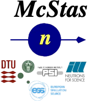

#  **ESS Source-Term Models in McStas** (v0.1 2026/09/07) 

*Comparisons between available source-term descriptions ahead of commissioning*

Prepared from: “[Available McStas models of the ESS source – Simulation pipeline toward commissioning (August 2026)](presentation)”, P. Willendrup, DMSC/DRAM and DTU Physics.

  
  
  
  

# 1. Purpose and context

McStas simulates only thermal-neutron transport, so the neutron production, moderation and shielding physics of the ESS target station itself is handled upstream by a full-physics Monte Carlo code (MCNP). Every source description used inside McStas is therefore, in one way or another, a derivative of MCNP output – either a parametrised fit to it, or a resampled/filtered version of MCNP particle-list data. This note summarises the comparisons made between the source-term options currently available to McStas users of the ESS instrument suite, as presented in the referenced slide deck, and what those comparisons show about the readiness of each option for beamline simulation.

Two moderator geometries recur in the material behind these comparisons: the early “TDR” design and its “pancake” derivatives, and the current “butterfly” moderator, of which two versions exist – BF2 (studied in most depth by T. Schönfeldt) and BF1, the version that was adopted as the long-term ESS baseline. Because the analytical brightness equations were originally fitted to BF2 and only later adapted to BF1, this adaptation step is one of the underlying uncertainties the comparisons below are trying to quantify.

This revision additionally draws directly on the six McStas instrument (.instr) files that implement the pipeline described below and were used to generate the co-plots published at [essbutterfly.mcstas.org/2026](https://essbutterfly.mcstas.org/2026): one instrument that generates the filtered MCPL inputs, one ESS_butterfly-only reference instrument, and four instruments that each consume raw MCPL, filtered MCPL, filtered-and-rotated MCPL, and a trained KDSource model respectively. Reading the code makes several statements in the presentation fully explicit and quantitative, and in a couple of places refines a number quoted from a slide screenshot; both are noted where they occur.

# 2. The source terms being compared

Five related but distinct source descriptions appear in the comparisons, summarised in Table 1; §3 below explains, instrument by instrument, exactly how each one is produced and processed.

<table>
<colgroup>
<col style="width: 24%" />
<col style="width: 75%" />
</colgroup>
<thead>
<tr class="header">
<th><strong>Source term</strong></th>
<th><strong>Description</strong></th>
</tr>
</thead>
<tbody>
<tr class="odd">
<td><strong>ESS_butterfly</strong></td>
<td>McStas component implementing T. Schönfeldt's parametrised, fitted analytical description of moderator brightness as a function of emission coordinates, beamport angle, wavelength and time. Originally characterised for the BF2 design and later adapted to the BF1 geometry (the long-term ESS baseline). Assumes the design operating point of 2.5 GeV, 2 MW.</td>
</tr>
<tr class="even">
<td><strong>MCPL – raw</strong></td>
<td>Particle list exported directly from the full MCNP model (target, moderators, monolith) at the intersection of the DXTRAN sphere with the cylindrical beam-extraction wall for a given beamport. Highest physical fidelity, but consists of relatively few, high-weight “analogue” particles, giving visibly noisy distributions; files are large (≈ 4–6 GB per beamport). Used directly by setting filter=0 in the MCPL-based test instruments, which then apply the beamport-aperture cut and the shared downstream pipeline (§3.4) at run time. <strong>Optional smearing of high-weight / analogue particles.</strong></td>
</tr>
<tr class="odd">
<td><strong>MCPL – filtered</strong></td>
<td>
Raw MCPL events collimated to the beamport aperture (12×12 cm, evaluated 2 m from the moderator) by ESS_MCPL_generate_filtered.instr and re-saved in their original state.

Still expressed in the same axis-permuted target-station (TCS-derived) coordinate frame as the raw export. <strong>Optional smearing of high-weight / analogue particles.</strong>
</td>
</tr>
<tr class="even">
<td><strong>MCPL – filtered &amp; rotated</strong></td>
<td>Filtered events directly in instrument (ISCS/McStas) coordinates and restricted to wanted wavelength range. <strong>Optional smearing of high-weight / analogue particles.</strong></td>
</tr>
<tr class="odd">
<td><strong>KDSource (and KDSource ×100)</strong></td>
<td>Kernel-density resampling model trained on the filtered-and-rotated MCPL events, its nloop (repeat) setting controls how many independent samples are drawn per underlying event, e.g. to produce a ×100-statistics variant. Intended as the practical, guide-ready form of the MCPL data. <strong>Optional smearing of high-weight / analogue particles.</strong></td>
</tr>
</tbody>
</table>

*Table 1. Source-term variants compared in the deck. “Filtered” and “filtered & rotated” are intermediate stages in turning a raw MCPL export into a guide-ready source; KDSource is the practical end point of that pipeline.*

# 3. How the source terms are produced and used – the instrument pipeline

The comparisons in §4 are generated by six McStas instrument files that share a common structure: one file turns a beamport's raw MCPL export into reduced, guide-ready inputs; one is a pure ESS_butterfly reference; and four read those reduced inputs (or a KDSource model built from them) through an identical downstream pipeline before feeding the same guide. Table 2 summarises the role of each file; the subsections below describe the mechanics in the order a neutron actually experiences them.

| **Instrument file**                                | **Role**                                                                                                                                                                                                                           |
|----------------------------------------------------|------------------------------------------------------------------------------------------------------------------------------------------------------------------------------------------------------------------------------------|
| **ESS_MCPL_generate_filtered.instr**               | Pre-processing step: reads a beamport's full-size, target-division MCPL export and writes a reduced “filtered” MCPL file containing only the events that survive two collimation cuts, restored to their original (as-read) state. |
| **ESS_butterfly_Guide_curved_test.instr**          | The pure-analytical reference instrument: a genuinely-traced ESS_butterfly source feeding the same 10 m + 50 m guide and monitor suite used by every instrument below.                                                             |
| **ESS_butterfly_MCPL_test.instr**                  | Reads a beamport's raw or filtered MCPL file (selected via the filter parameter), applies the shared downstream pipeline (§3.4), and feeds the same guide.                                                                         |
| **ESS_butterfly_MCPL_filtered_test.instr**         | Fixed-configuration variant of the above, hard-wired to the “filtered” (still target-station-frame) MCPL file.                                                                                                                     |
| **ESS_butterfly_MCPL_filtered_rotated_test.instr** | As above but a “filtered & rotated” (instrument-frame) MCPL file in “instrument” / McStas coordinates.                                                                                                                             |
| **ESS_butterfly_KDSource_test.instr**              | Replaces the MCPL reader with a trained KDSource kernel-density model for the beamport, resampled nloop (= repeat) times, then passed through the same shared downstream pipeline.                                                 |

*Table 2. The six instrument files behind the [essbutterfly.mcstas.org/2026](https://essbutterfly.mcstas.org/2026) comparisons.*

## 3.1 Generating the filtered MCPL inputs

ESS_MCPL_generate_filtered.instr reads a beamport's raw MCPL export (e.g. S2.mcpl.gz) through a fixed pair of –90° rotations (about the vertical axis, then about the horizontal) plus a –0.137 m offset – a one-off axis-convention correction applied identically to every sector and beamline, distinct from the sector-specific rotation later used to place ESS_butterfly itself.

Each event is then put through two successive geometric cuts, each evaluated by temporarily extrapolating the particle's straight-line trajectory onto a reference plane (McStas’s PROP_Z0, with backward propagation allowed) without altering its stored state:

- a 12×12 cm cut, evaluated 2 m from the moderator along the direction the beamport is centred on – “does this particle end up inside the beamport aperture at all?”. **User-adjustable collimation size.**

- a 24×6 cm cut, evaluated 0.08 m from the moderator, plus a cut restricting wavelength to Lmin–Lmax – this defines the artificial “source-plane” used by everything downstream. **User-adjustable collimation size and Lmin – Lmax interval.**

Events that survive both cuts are written back out exactly as they were read in: their MCNP position, velocity and time are restored from a saved copy immediately before the final MCPL_output, so filtering only decides which events to keep – it never modifies a surviving event's phase space.

The ESS_butterfly component also appears in this instrument, correctly placed and rotated for the sector/beamline in question – but its WHEN clause is permanently false whenever both an input and output MCPL filename are set, which is always the case, so it never actually contributes simulated neutrons here. As confirmed for this note, it is included purely so that mcdisplay renders the moderator geometry for visual cross-checking against the MCNP-derived particle cloud; this is true of every MCPL- and KDSource-fed instrument described below.

## 3.2 Two coordinate frames, and how each file is read back

Because the fixed two-rotation transform above is applied on read, and not the per-beamline rotation used to position ESS_butterfly, the “filtered” file it produces is still expressed in axes derived directly from the original target-station (TCS) export – merely permuted to McStas's axis convention, not rotated into any particular beamline's local frame. The instruments that consume such files (ESS_butterfly_MCPL_test.instr, ESS_butterfly_MCPL_filtered_test.instr) read them back through the identical pair of rotation arms, confirming they remain TCS-frame data.

A second-stage “filtered & rotated” file, consumed by ESS_butterfly_MCPL_filtered_rotated_test.instr, is instead read with the MCPL reader placed directly at the ESS_butterfly source component's own position and orientation, with no extra rotation arms at all. That only works if the file's stored coordinates are already expressed in the instrument's (ISCS/McStas) frame, sector/beamline rotation included – confirming this is the “instrument coordinates” file referred to in the presentation. The KDSource-based instrument follows the same convention: its trained model is likewise read directly at the source position.

## 3.3 The ESS_butterfly-only reference instrument

ESS_butterfly_Guide_curved_test.instr is the “clean” comparison baseline: a genuinely-traced ESS_butterfly source feeds a 10 m straight guide directly into a 50 m curved guide (radius 3000 m). The guide's cross-section, as coded, is 5 cm wide × 10 cm high – a refinement of the “4 cm × 8 cm” figure quoted from a slide screenshot in the previous revision of this note, which the instrument file supersedes.

Cold/thermal classification of each source neutron is done immediately downstream of the source by a simple 20 meV energy threshold, feeding the per-species monitors used throughout (MonND2/MonND2_2, TWidth/CWidth, and the BrillmonCOLD.../BrillmonTHRM... brilliance monitors). The “collimated” brilliance monitors used for calibration against MCNP are windowed to the central vertical third of the moderator and to a beamline-dependent horizontal strip (0–5.8 cm for beamline 1, 0–6 cm for beamline 2, 1.1–7.1 cm for every other beamline) – a fixed per-beamline lookup table baked into the instrument rather than a general formula. End-of-guide diagnostics (Monitor2_xy1, Monitor_X/Y, Monitor_divH/V out to ±1.5°, Monitor_t out to 350 ms) are all colocated just past the curved guide's exit, and are the monitors behind the per-beamport percentage differences in §4.5.

## 3.4 The pipeline shared by every MCPL- and KDSource-fed instrument

A single block of logic (a Focus_cut component, an absolute-rate rescaling, and a SPLIT/smear step at BackTrace) is reused, essentially verbatim, across ESS_butterfly_MCPL_test.instr, its filtered and filtered-rotated variants, and the KDSource instrument. Every source-term variant downstream of raw MCPL therefore passes through the same four-step conversion before reaching the guide:

- Absolute-rate normalisation – each event's MCNP statistical weight is rescaled by a fixed weightmultiplier = 1.56×10¹⁶ / 1×10⁵, labelled in the code as “(ESS protons/s @ 5MW) / MCNP nps”, converting a weight computed for a 1×10⁵-proton MCNP batch into an absolute McStas neutrons/s rate.

- Beamport-aperture cut, only when needed – an instrument fed a file that has not already been filtered (filter=0) re-applies the same 12×12 cm aperture cut from §3.1 on the fly; when fed an already-filtered file this step is skipped, so events are never cut twice.

- Variance reduction for “heavy” events – any event whose rescaled weight exceeds a threshold (thres, default 4×10⁸) is stochastically split into 10 sub-rays, each carrying a tenth of the weight and independently jittered: a flat Monte Carlo displacement in position, a Monte Carlo change of direction, and a uniform fractional change of speed. This is the concrete mechanism that turns the handful of high-weight “analogue” MCPL particles flagged in the presentation into usable, low-variance statistics.

- Long-pulse time convolution – after back-propagating to the source-plane (the same 0.08 m point and 24×6 cm / wavelength cut as in §3.1), each event – originally computed for an instantaneous, Dirac-delta proton pulse – receives a new random time offset drawn uniformly across one ESS long pulse, with anything landing beyond three pulse-durations discarded. This is the concrete implementation of the “long-pulse MC choice” step referred to in the presentation.

In every one of these instruments the ESS_butterfly component is still present, correctly placed and rotated for the sector/beamline in question, but is permanently disabled – again, present purely so the moderator geometry renders in 3D views, never contributing simulated neutrons.

## 3.5 The KDSource variant

ESS_butterfly_KDSource_test.instr replaces the MCPL reader with a KDSource component reading a pre-trained kernel-density resampling model for that beamport (named “\<sector\>\<beamline\>\_source_10000.xml”), directly at the source position – i.e. already in ISCS coordinates, matching the filtered-and-rotated convention. Its nloop setting (exposed as the instrument's repeat parameter) controls how many independent samples the trained model draws per underlying event – the natural way to generate a higher-statistics variant such as “KDSource ×100” without retraining the model.

Everything downstream – the aperture cut, absolute-rate normalisation, heavy-event splitting/smearing and long-pulse time convolution – is exactly the shared pipeline described in §3.4, so KDSource-drawn neutrons are put through an identical post-processing chain to their MCPL-drawn counterparts before reaching the guide, keeping the end-of-guide comparisons in §4.3 and §4.5 on an equal footing.

# 4. Comparison methods used

## 4.1 Geometric alignment

Before any flux comparison is meaningful, the McStas ESS_butterfly component geometry and the MCNP monolith/moderator geometry have to agree on where a given beamport actually is. The deck overlays the two geometries (e.g. for beamport W8) in both the target-centred (TCS) and instrument/McStas (ISCS) coordinate systems as a sanity check before any quantitative comparison is attempted.

## 4.2 Benchmarking against target-division reference data

The McStas 2.5 GeV/BF1 ESS_butterfly component was benchmarked against reference brightness distributions published by the ESS target division (technical report ESS-0068256/ESS-0068298). For beamports W1 and W11, McStas cold and thermal brightness profiles along the horizontal axis perpendicular to the beam direction were overlaid on the corresponding MCNP-derived reference curves; results are published and kept up to date at

the [ESS_butterfly benchmarking website](http://essbutterfly.mcstas.org/).

## 4.3 End-to-end comparison through a mock instrument

To compare the source terms in a way that reflects how they are actually used, each variant (ESS_butterfly, raw MCPL, MCPL filtered, MCPL filtered & rotated, KDSource, and KDSource ×100, all for beamport W8) was propagated through the same simple mock-up instrument: a 10 m straight guide section followed by a 50 m curved guide (radius ≈ 3000 m), 5 cm wide by 10 cm high (see §3.3). Two sets of measurements were compared:

- At the source plane directly – useful for sanity-checking the source terms themselves, but not a fair like-for-like comparison, since the different variants define their starting phase space slightly differently (“apples and pears”, in the author’s words).

- At the end of the guide – mean and peak brilliance (cold and thermal, wavelength-resolved), beam width, divergence and time-of-flight monitors. This is the physically meaningful comparison, since transport through the guide re-expresses all source terms in the same, common phase space.

The main qualitative finding at this stage was statistical rather than physical: the raw MCPL data, being made of relatively few high-weight “analogue” particles, produces visibly noisy (“smeared”) monitor histograms, particularly in time-of-flight structure. The filtered/rotated MCPL and the KDSource-resampled variants remove this noise while tracking the same underlying distribution, and – downstream, after guide transport – agree closely with each other and with ESS_butterfly in overall shape.

## 4.4 User-adjustable performance handles

Both sides of the comparison expose tunable settings that affect the absolute scale of the output, and are worth keeping in mind when reading the results below as a fixed benchmark rather than a snapshot of current defaults. The ESS_butterfly component takes a scalar cold/thermal brilliance multiplier (c_performance / t_performance, both defaulting to 1 – “simple perf. scaling”) and an accelerator power acc_power, whose component default of 5 MW is a legacy TDR-era value that in practice is being used to represent the 2.5 MW BF1 operating point; wavelength range, number of pulses, and (via compile-time -D defines) the proton pulse duration and frequency can also be adjusted by the user. On the MCPL/KDSource side, the deck flags per-beamport KDSource kernel/bandwidth optimisation as a setting that “can / should” be tuned – emphasised in the source material as still needing attention. None of this invalidates the comparisons that follow, but it means the quoted agreement reflects today’s default tuning on both sides, not a hard ceiling on either model.

## 4.5 Systematic per-beamport scan: ESS_butterfly vs. raw MCPL

The most extensive quantitative comparison covers 19 beamports across all four sectors (East 2, 3, 5, 7; West 1–8 and 11; North 5, 7; South 1–4), for which Esben produced MCPL export files. For each port, the integrated end-of-guide monitor intensity from ESS_butterfly was differenced against the corresponding raw-MCPL result and expressed as a percentage; results are tabulated in the deck and reproduced in Table 2, and plotted per-port at

[essbutterfly.mcstas.org/2026](https://essbutterfly.mcstas.org/2026/).

| **Port** | **Diff.** | **Port** | **Diff.** | **Port** | **Diff.**       |
|----------|-----------|----------|-----------|----------|-----------------|
| E2       | +1.12%    | S2       | -0.44%    | W5       | -18.61%         |
| E3       | -15.00%   | S3       | -13.57%   | W6       | -18.70%         |
| E5       | -20.52%   | S4       | -10.51%   | W7       | -11.41%         |
| E7       | -12.07%   | W1       | +8.17%    | W8       | -10.34%         |
| N5       | -19.11%   | W2       | -1.23%    | W11      | **+202.67% \*** |
| N7       | -10.06%   | W3       | -14.33%   |          |                 |
| S1       | -3.93%    | W4       | -10.09%   |          |                 |

*Table 2. Percentage difference (ESS_butterfly − raw MCPL) / MCPL, at the end-of-guide monitor, per beamport. \* W11 is a known outlier – see below.*

With the exception of one outlier, the analytical ESS_butterfly model tracks the raw MCNP-derived transport to within roughly ±20% at every beamport tested, and to within a few percent at several (E2, S1, S2, W2). The sign is not uniformly one-directional: ESS_butterfly overestimates intensity at a few ports (E2, W1) and underestimates it at most others, which is consistent with a fitted analytical model applied outside the exact conditions (BF2→BF1 adaptation, angular interpolation) it was originally derived for, rather than with a systematic bias in one direction.

The W11 outlier (+202.67%) was traced to a data-provenance issue rather than a modelling error: the DXTRAN sphere used to generate that beamport’s reference MCNP data missed the beamport by roughly half its aperture. File timestamps show the W11 dataset was in fact computed four years after the other ports (2021 vs. 2017), so it does not share the same MCNP model/geometry revision as the rest of the scan. It is flagged in the source deck as “a nasty outlier… has a good explanation” and should be excluded when judging the general agreement of the model.

# 5. Summary of findings

- The parametrised ESS_butterfly component, though derived from BF2 modelling and adapted to BF1, reproduces full MCNP transport results to within roughly ±20% at essentially all beamports checked – adequate for early instrument-design work, with one flagged, explained outlier.

- Raw MCPL files carry the highest-fidelity physics but are statistically noisy (high-weight analogue particles) and impractically large (4–6 GB per beamport); they are not suitable for direct use in beamline simulation without further processing.

- The filtered / filtered-and-rotated / KDSource processing pipeline turns raw MCPL into a guide-ready source that removes the sampling noise while preserving the MCNP-derived distribution; end-of-guide results from KDSource agree well with both the raw MCPL and with ESS_butterfly.

- Geometric alignment between the MCNP and McStas descriptions was checked directly by overlay and found consistent for the beamports examined.

# 6. Open items and caveats — “not a shrink-wrapped solution”

The presentation is explicit that several pieces of this comparison are still in progress, and poses a number of the open points as questions rather than settled answers:

- The slide material mixes geometries from multiple historical moderator designs (TDR, pancake, BF1, BF2), shown in places for illustrative/pedagogical purposes only – not all of it reflects the current baseline.

- All comparisons above assume the nominal “as-designed” operating point (2.5 GeV, 2 MW). Extending the comparison to other, “asymptotic” operating conditions relevant to the accelerator ramp-up will require additional MCNP runs, most likely delivered again via MCPL.

- There is not yet a validated “Day 1” (early commissioning) source model. Building one needs fresh MCPL input – status still to be confirmed – and ideally comparisons repeated at several fixed points spanning the ramp-up phase, rather than a single design-point comparison. Whether performance can simply be treated as linear in proton current across those ramp-up steps, or needs its own dedicated modelling, is called out as an open question rather than assumed.

- Turning MCPL data into a usable KDSource is currently a per-beamport exercise requiring manual tuning; scaling this to all beamports and ramp-up states will need continued collaboration between the McStas team – possibly together with Doug – and beamline instrument staff, with ownership still to be worked out.

# 7. References

- Benchmarking website for the McStas ESS_butterfly component – [essbutterfly.mcstas.org](https://essbutterfly.mcstas.org/)

- 2026 per-beamport comparison plots – [essbutterfly.mcstas.org/2026](https://essbutterfly.mcstas.org/2026)

- Using MCPL as source term in McStas (ESS Confluence) – [confluence.ess.eu/spaces/MCSTAS/pages/217715439](https://confluence.ess.eu/spaces/MCSTAS/pages/217715439)

- Example instrument (ESS_butterfly + MCPL input, TCS coordinates) – from github.com/mccode-dev/McCode, mcstas-comps/examples/ESS/ESS_butterfly_MCPL_test - available in the folder [INSTRUMENTS](INSTRUMENTS)

- MCPL format and tools – [mctools.github.io/mcpl](https://mctools.github.io/mcpl)

- Instrument files behind §3: [ESS_MCPL_generate_filtered.instr, ESS_butterfly_Guide_curved_test.instr, ESS_butterfly_MCPL_test.instr, ESS_butterfly_MCPL_filtered_test.instr, ESS_butterfly_MCPL_filtered_rotated_test.instr, ESS_butterfly_KDSource_test.instr](INSTRUMENTS) (P. Willendrup, DMSC/DRAM and DTU Physics).
